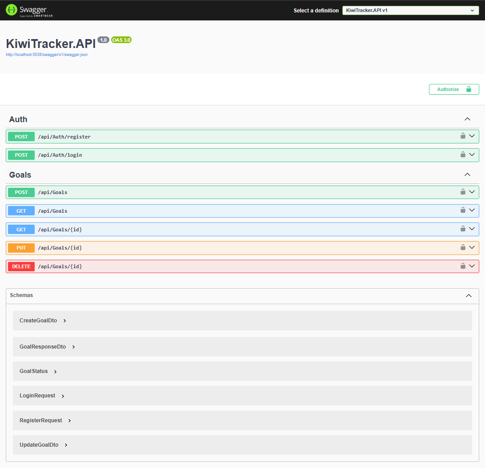

# 🥝 KiwiTracker API

**Backend service for a personal goal-tracking system.**  
Built with .NET 8, designed for high performance and clean architecture.

## Screenshots

### Swagger API Documentation

## 🚀 Features
- **Secure Auth:** JWT-based authentication with password hashing (BCrypt).
- **Goal Management:** Full CRUD for personal goals.
- **Relational Data:** PostgreSQL integration with Entity Framework Core.
- **Auto-migrations:** Database schema updates automatically on startup.
- **Clean Code:** Separation of concerns (Controllers -> Services -> Repository).

## 🛠 Tech Stack
- **Language:** C# 12
- **Framework:** ASP.NET Core 8.0 (Web API)
- **ORM:** Entity Framework Core
- **Database:** PostgreSQL
- **Security:** JwtBearer Authentication
- **Infrastructure:** Deployed on Railway / Docker support (planned)

## 🏗 Project Structure
- `Controllers/`: API Endpoints.
- `Services/`: Business logic.
- `Models/`: Database entities & DTOs.
- `Data/`: DB Context & Migrations.

## 🏁 Getting Started
1. Clone the repo.
2. Setup your PostgreSQL connection string in `appsettings.json`.
3. Run `dotnet ef database update`.
4. Run `dotnet run`.g